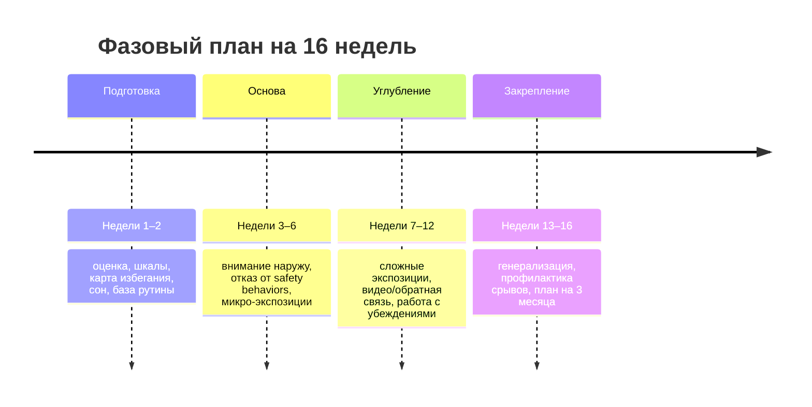
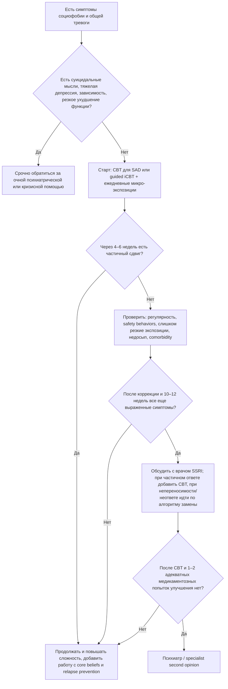

# Пошаговый план преодоления социофобии и общей тревожности

## Краткое резюме

Если цель — **реально уменьшить социофобию**, а не просто “стать спокойнее”, то на сегодня лучший опорный маршрут выглядит так: **индивидуальная CBT, специально разработанная для social anxiety disorder**, с обязательными **поведенческими экспериментами и экспозицией**, работой с **самофокусом, защитными поведениями, негативным образом себя, пред- и постсобытийным пережёвыванием**, плюс регулярный мониторинг прогресса. Именно такой подход NICE ставит на первое место для взрослых с социофобией; WFSBP также относит CBT к первой линии психотерапии. citeturn16view1turn34view0turn13view3turn15view1

Для медикаментозной линии наиболее устойчиво поддержаны **SSRIs** и **venlafaxine**; NICE рекомендует начинать с **escitalopram** или **sertraline**, если человек выбирает фармакотерапию, а при неполном ответе через **10–12 недель** — добавлять CBT или менять препарат по алгоритму. Полный анксиолитический эффект развивается **не сразу**: NICE пишет о постепенном развитии эффекта “**over 2 weeks or more**”, NHS — что антидепрессанты могут **начать помогать через 1–2 недели**, но полноценный эффект иногда занимает **до 8 недель**. Подбор, титрация, смена и отмена лекарств требуют врача. citeturn16view1turn34view0turn26view0turn15view0

Для человека с **12-часовыми сменами 6 дней в неделю** главный принцип такой: не пытаться лечиться “большими блоками”, а строить прогресс на **микродозах терапии**. Рабочий вариант — **утренний 10–15-минутный блок**, **два 20-минутных терапевтических окна на работе**, **вечерний 15–25-минутный блок**, и **один удлинённый слот в выходной** для планирования экспозиций и, по возможности, онлайн-сессии. Такая адаптация особенно логична, потому что NICE допускает **CBT-based supported self-help**, а исследования показывают, что **iCBT, мобильные и модульные цифровые форматы** могут быть эффективны и лучше встраиваться в день. citeturn34view0turn24view0turn24view2turn24view3

Для **общей тревожности** наилучшая добавка к этому маршруту — не отдельная “магическая техника”, а связка: **психообразование, самонаблюдение, снижение избегающего поведения, сон, регулярная физическая активность, минимизация алкоголя/никотина, навыки медленного дыхания и mindfulness/ACT как вспомогательные, но не заменяющие методы**. Испанское клиническое руководство по GAD прямо рекомендует пошаговую стратегию, начинающуюся с **психообразования, self-management, здоровых привычек, сна и само-помощи**, с активным использованием шкал и совместного принятия решений. citeturn18view0turn18view1turn19view0turn19view1

Самое важное: **не ждать исчезновения тревоги перед действиями**. При социофобии улучшение обычно приходит **после многократных корректных контактов с пугающими ситуациями**, а не до них. Клинические кейсы и case-series снова и снова показывают одни и те же поворотные моменты: снижение самофокуса, отказ от защитных ритуалов, видеообратная связь, внешне-направленное внимание, ценностное действие вопреки тревоге, а также перенос терапии в реальную жизнь и рутинные ситуации. citeturn34view0turn31view0turn8view0turn8view1turn8view2turn29view1turn6view4turn35view1

## Что работает лучше всего по современным данным

Главный ориентир до сих пор задаёт NICE: взрослым с social anxiety disorder следует **предлагать индивидуальную CBT, специально разработанную для SAD**, в варианте Clark & Wells или Heimberg. NICE отдельно описывает состав такой терапии: психообразование, демонстрация вреда самофокуса и защитных поведений, **video feedback**, тренировка внешнего фокуса внимания, **within-session behavioural experiments**, работа с травматическими социальными воспоминаниями, модификация core beliefs, работа с anticipatory worry и post-event processing, а затем relapse prevention. Рекомендуемая структура — примерно **до 14 сессий по 90 минут за 4 месяца** для Clark & Wells или **15×60 минут плюс 1×90 минут** для Heimberg. citeturn34view0

Почему именно этот вектор считается базовым: крупная сеть сравнений Mayo-Wilson и соавт. показала, что при остром лечении SAD у взрослых **психологические и фармакологические вмешательства в целом эффективны**, но **индивидуальная CBT** и ряд лекарств демонстрировали лучшие результаты, а новые обзоры продолжили подтверждать, что **психотерапия для SAD в среднем даёт умеренно-крупные и крупные эффекты**. В более свежем сетевом мета-анализе 2026 года CBT снова оказалась среди наиболее устойчиво работающих нефармакологических подходов, хотя авторы справедливо отмечают, что уверенность в сравнительных различиях между активными вмешательствами часто низкая или умеренная. citeturn12search0turn12search5turn36view0

Отдельно важно, что **групповая CBT работает**, но NICE всё же **не рекомендует ставить её выше индивидуальной**, потому что индивидуальный формат оказался клинически и экономически выгоднее. При этом мета-анализ группы Barkowski и соавт. подтверждает, что **group psychotherapy для SAD действительно эффективна**, просто она не всегда оптимальный первый выбор, если есть доступ к индивидуальной терапии. Для твоего графика это означает: **группа — нормальный запасной вариант**, но **индивидуальная очная/онлайн CBT или guided iCBT** обычно лучше подстраиваются под жизнь. citeturn34view0turn23search0

По лекарствам данные тоже достаточно ясны. WFSBP указывает, что для SAD **первой линией среди препаратов** являются **SSRIs** — escitalopram, fluvoxamine, paroxetine, sertraline — и **SNRI venlafaxine**; скриншот табл. 12 прямо маркирует эти позиции как first-line для SAD. NICE даёт более практичный клинический алгоритм: если человек выбирает медикацию, начать с **escitalopram или sertraline**; если ответа нет, перейти на **fluvoxamine / paroxetine** или **venlafaxine**; если и это не помогло — обсуждать **MAOI**, например phenelzine или moclobemide, под врачебным контролем. Обновлённый мета-анализ антидепрессантов 2022 года также нашёл, что **SSRIs и venlafaxine** статистически повышают вероятность ответа и уменьшают выраженность симптомов по сравнению с плацебо. citeturn15view0turn15view1turn34view0turn39search1

Что **не стоит переоценивать**. NICE прямо не рекомендует рутинно предлагать для SAD **benzodiazepines**, **tricyclics**, **antipsychotics**, а также **mindfulness-based interventions как стартовый монотерапевтический выбор** при социофобии. Это не означает, что mindfulness бесполезен вообще; это означает, что он **не должен заменять disorder-specific CBT/exposure**, если цель — именно преодоление социофобии. В то же время для тревожных расстройств шире у mindfulness/acceptance-подходов есть рабочая база: RCT в JAMA Psychiatry показал, что **MBSR оказался noninferior escitalopram** при тревожных расстройствах, а мета-анализ Haller и соавт. нашёл краткосрочные анксиолитические эффекты ACT/MBCT/MBSR в DSM-5 anxiety disorders. Поэтому я бы ставил mindfulness и ACT **как усилители маршрута**, а не как замену экспозиции и CBT-механизмам. citeturn16view0turn16view1turn21search0turn28search0

Технологические форматы стали реально полезнее. NICE допускает **supported self-help** для тех, кто отказывается от полной CBT; WFSBP пишет, что **iCBT** может использоваться как мост в ожидании терапии или как add-on; мобильное RCT 2018 года показало, что **guided ICBT через смартфон и через компьютер** превосходило waitlist, а выигрыш сохранялся на follow-up; модульная цифровая social-anxiety CBT в 2025 году показала безопасность, приемлемость и эффективность в двух RCT; guided internet psychodynamic therapy тоже продемонстрировала значимое уменьшение симптомов, хотя для SAD всё равно золотым стандартом остаётся CBT. При длинных сменах это особенно важно: **“достаточно хорошая, но регулярная digital CBT” часто лучше, чем идеальная терапия, которая постоянно срывается по расписанию**. citeturn34view0turn15view0turn24view0turn24view2turn24view3

## Фазовый план лечения под твой график

Ниже — **практический 16-недельный план**, который опирается на структуру evidence-based CBT для SAD, алгоритмы NICE/WFSBP и на stepwise логику современных гайдов по тревоге. Это не заменяет врача или психотерапевта, но даёт рабочую рамку, если у тебя очень мало времени. citeturn34view0turn15view1turn18view0turn19view1

### Фаза подготовки

Первые две недели не должны уходить на “просто чтение про тревогу”. Цель — быстро создать **рабочую карту проблемы**. NICE рекомендует при оценке учитывать **страх, избегание, дистресс и функциональное нарушение**, а также использовать валидированную шкалу вроде **SPIN или LSAS** для отслеживания эффекта. Поэтому в начале я бы делал три вещи:  
**первое** — раз в неделю одну и ту же шкалу;  
**второе** — список всех избегаемых ситуаций от лёгких до тяжёлых;  
**третье** — фиксацию твоих типичных **safety behaviors**: избегание взгляда, репетиции фраз, лишние извинения, говорение слишком тихо, проверка лица/рук/голоса, спрятанный телефон, уход в угол, преждевременный выход из диалога, чрезмерное объяснение себя. citeturn32view3turn34view0turn19view0

Измеримые цели этой фазы: к концу второй недели у тебя должны быть **одна базовая шкала**, **лестница минимум из 15–20 социальных ситуаций**, **список 5–10 защитных поведений**, и **стабильная минимальная рутина**, которую ты реально держишь не менее чем в **70% дней**, а не “идеальный план”, который рассыпается. Это — не формальный критерий из гайдов, а практический ориентир, потому что без стабильности дальнейшая экспозиция не удержится. Основание для такой логики — emphasis руководств на self-monitoring, shared decision-making и routine outcome measures. citeturn18view0turn19view1turn34view0

### Фаза основы

С третьей по шестую неделю начинается то, что уже **меняет механизм** социофобии. В Clark & Wells-модели особенно важны: **снижение самофокуса**, **снятие safety behaviors**, **внешне-направленное внимание** и **поведенческие эксперименты**. На практике это означает ежедневные маленькие действия: смотреть вовне, замечать собеседника, не “измерять” себя во время разговора, не спасать себя ритуалами, а потом проверять, что реально произошло. Именно такие элементы NICE перечисляет внутри терапии первой линии. citeturn34view0

Измеримые цели на этот блок:  
выполнять **по 1 микрo-экспозиции в каждый рабочий день** и **1–2 удлинённые экспозиции в выходной**;  
выбрать **2 ключевых safety behavior** и последовательно их сокращать;  
вести короткий лог “прогноз → действие → исход”;  
уменьшать время на post-event rumination, откладывая его в отдельное “окно пережёвывания”, а не позволяя ему захватывать весь вечер. Это соответствует той части NICE-модели, где отдельно названы work on pre- and post-event processing и behavioural experiments. citeturn34view0

### Фаза углубления

С седьмой по двенадцатую неделю поднимается сложность. Здесь обычно и появляется ощущение “я вроде стараюсь, но тревога всё ещё есть”. Это нормальная точка. К этому моменту у многих людей уже уменьшается избегание, но остаются **жёсткие core beliefs** — например: “если я покажусь напряжённым, меня сочтут слабым”, “если я не понравлюсь сразу, это провал”, “если я замнусь, люди это запомнят”. NICE прямо включает в терапию **video feedback**, работу с core beliefs и rescripting/discrimination training для старых социальных воспоминаний. Именно здесь прогресс часто ускоряется. citeturn34view0

Измеримые цели этого блока: не менее **40–60 выполненных экспозиций суммарно**, как минимум **1 средняя или трудная экспозиция в неделю**, еженедельная шкала, и заметный сдвиг по функции: легче инициировать диалог, меньше откладывать звонки/вопросы/контакты, меньше избегать наблюдаемой активности. Если ты идёшь через медикаменты, то именно этот интервал важен для оценки эффекта: NICE рекомендует при частичном ответе на SSRI через **10–12 недель** либо добавить CBT, либо по алгоритму менять препарат. citeturn34view0

### Фаза закрепления

С тринадцатой по шестнадцатую неделю задача меняется: уже не “уменьшить симптом”, а **не дать проблеме тихо rebuild-нуться**. Рецидив при социофобии чаще всего возвращается не как резкий срыв, а как **постепенное увеличение избегания**: пропустил разговор, перестал инициировать вопросы, снова начал долго репетировать, снова ушёл в постоянный self-monitoring, и тревога собралась обратно. Поэтому relapse prevention — обязательная часть всех основных протоколов SAD-CBT. citeturn34view0turn15view0

Цели этой фазы: иметь **личный план ранних признаков отката**, **минимальный недельный план поддержания**, список “что делать в плохую неделю”, и привычку не прекращать экспозиции после первых улучшений. Для тех, кто на лекарствах, NICE рекомендует при хорошем ответе в первые 3 месяца **продолжать фармакотерапию минимум ещё 6 месяцев**, а отменять постепенно. Это уже зона врача. citeturn34view0turn26view0

## Ежедневная рутина для 12-часовых смен

Ниже расписание, которое специально сделано под **минимально достаточную, но реалистичную дозу**. Это не “идеальный wellness-ритуал”, а **режим лечения в условиях дефицита времени**. Он опирается на принципы CBT для SAD, stepwise self-management для тревоги, а дыхательные блоки использует как **инструмент регуляции**, а не как способ избегать экспозиции. Данные по дыхательным упражнениям у взрослых показывают полезный эффект для тревоги и стресса, но обзор подчёркивает, что доказательная база всё ещё ограничена; поэтому дыхание — помощник, а не ядро лечения. citeturn18view0turn19view0turn20search2turn20search6

### Краткая таблица дня

| Время | Что делать | Длительность | Частота | Как прогрессировать |
|---|---|---:|---:|---|
| Утро до смены | короткая настройка: 2 мин дыхания + 3 мин внешний фокус внимания + 5 мин план одной экспозиции на день | 10–12 мин | ежедневно | через 2 недели добавить 3–5 мин записи прогноза и альтернативного поведения citeturn34view0turn18view0 |
| Перерыв на работе | регуляция: ходьба + медленное дыхание + мини-экспозиция | 20 мин | ежедневно | сначала лёгкие задания, затем ситуации с обратной связью/риском оценки citeturn20search2turn34view0 |
| Второй перерыв | поведенческий эксперимент и короткий лог “что ожидал / что вышло” | 20 мин | ежедневно | постепенно убирать safety behaviors и повышать социальную неопределённость citeturn34view0 |
| Вечер после смены | 1 короткий разбор + 1 упражнение на defusion/cognitive restructuring + wind-down | 15–25 мин | 5–6 дней в неделю | к 6-й неделе делать 2–3 анализа в неделю глубже, а не каждый день долго citeturn34view0turn35view1 |
| Перед сном | цифровое торможение, однообразный ритуал, свет/тишина, без “разбора” социальной сцены в кровати | 20–30 мин | ежедневно | если бессонница держится и усиливает тревогу, обсуждать отдельное лечение сна citeturn18view1turn19view0 |
| Выходной | длинная экспозиция, пересборка лестницы, еженедельная шкала, при возможности онлайн-сессия | 45–90 мин | 1 раз в неделю | каждые 2 недели двигать 2–3 пункта лестницы вверх citeturn34view0turn24view0turn24view2 |

### Утренний блок

Утро не должно превращаться в проверку самочувствия. Его задача — **перевести тебя из режима “оценить угрозу” в режим “сделать следующий шаг”**. Оптимальный шаблон:  
**две минуты** медленного дыхания;  
**три минуты** упражнения на внешний фокус — заметить 5 звуков, 5 визуальных деталей, 3 телесных контакта с поверхностями;  
**пять минут** на план одного социального действия дня: конкретно кому, когда и что ты скажешь. Такой план согласуется с NICE-подходом к внешнему фокусу и поведению, а не к бесконечному анализу мыслей перед действием. citeturn34view0turn20search2

### Первый двадцатиминутный перерыв

Рабочий перерыв лучше делить на **регуляцию → действие → короткую фиксацию**. Практически это может выглядеть так:  
**5 минут** быстрой ходьбы;  
**5 минут** дыхания в темпе, который не ускоряет тебя — например, медленное диафрагмальное дыхание;  
**8 минут** мини-экспозиции;  
**2 минуты** отметить результат. Дыхательные обзоры показывают, что для снижения тревоги полезнее не “очень быстрые” формы, а более спокойные протоколы и повторяемая практика. citeturn20search2turn20search6

Микро-экспозиции для первого перерыва:  
сделать **короткий нейтральный вопрос** коллеге;  
попросить предмет/уточнение **без извиняющегося вступления**;  
сознательно говорить **на 10–15% громче**, чем обычно;  
на 5–10 секунд дольше держать естественный зрительный контакт;  
не перепроверять мысленно фразу после разговора. Эти задания — мини-версии тех самых behavioural experiments и отказа от safety behaviors. citeturn34view0

### Второй двадцатиминутный перерыв

Здесь акцент лучше сместить с регуляции на **проверку убеждений**. Сценарий:  
**2 минуты** записать прогноз: “если я спрошу / скажу / выступлю, случится Х”;  
**10–12 минут** сделать действие;  
**3 минуты** отметить, что реально произошло;  
**3 минуты** определить, какой защитный ритуал ты сократил;  
**оставшиеся минуты** — вернуть внимание наружу и идти дальше, не устраивая post-mortem-анализ. Именно такой формат сильнее всего попадает в доказанный механизм SAD-CBT. citeturn34view0

Примеры микро-экспериментов:  
спросить мнение, не подготавливая три версии фразы;  
вставить одно короткое несогласие или уточнение;  
сказать короткое “спасибо” или “доброе утро” первым;  
задать вопрос, на который тебе **неизвестен** идеальный ответ;  
допустить маленькую неидеальность — например, паузу, лёгкую оговорку — и **не спасать ситуацию** лишними объяснениями. Это особенно полезно, потому что многие кейсы прогресса при SAD включали именно работу с катастрофизацией собственных ошибок и сильной самокритикой. citeturn8view1turn8view2turn6view4

### Вечерний блок

После 12-часовой смены нужен не “второй рабочий день”, а короткая, но точная терапия. Лучший шаблон:  
**5 минут** — выбрать один эпизод дня и заполнить три строки: что я предсказывал, что сделал, что вышло;  
**5–10 минут** — когнитивное/ACT-упражнение;  
**5–10 минут** — успокаивающий переход ко сну. Если у тебя сильнее выражена самокритика, здесь особенно полезны элементы **self-compassion** как дополнение к CBT; case study 2024 года показал, что интеграция CBT и compassion-focused техники у молодой женщины с SAD сопровождалась снижением социальной тревоги и функционального нарушения, вместе с ростом self-compassion и более адаптивной регуляцией эмоций. citeturn8view2

Рабочие вечерние упражнения:  
**CBT-вариант**: “какие факты за / против моему прогнозу”, “что бы я сказал другу в такой ситуации”;  
**ACT-вариант**: назвать мысль как мысль — “мой ум сейчас выдаёт историю, что я выглядел глупо” — и всё равно выбрать ценностное действие на завтра;  
**анти-rumination-вариант**: ограничить пережёвывание 10 минутами сидя за столом, а не в кровати. ACT-подход особенно полезен, если ты склонен бесконечно пытаться “убрать” тревогу, а не жить вопреки ей. citeturn35view1turn28search0

## Сравнение техник по силе доказательств и пригодности для длинных смен

Оценки ниже — практическая синтезация из NICE, WFSBP, недавних мета-анализов и RCT. Там, где доказательная база ограничена или речь идёт об adjunct-подходе, я помечаю это прямо. citeturn34view0turn15view1turn36view0turn39search1

| Техника | Сила доказательств | Когда обычно заметен эффект | Временная нагрузка | Основные риски / ограничения | Насколько подходит при 12-часовой работе | Основание |
|---|---|---|---|---|---|---|
| Индивидуальная CBT для SAD | очень высокая | часто 4–8 недель, полный курс около 4 месяцев | 1 сессия в неделю + домашние задания | эмоциональный дискомфорт во время экспозиций, нужен регулярный тренинг | **очень подходит**, особенно онлайн/гибрид | citeturn34view0turn16view1turn12search5 |
| Экспозиция / поведенческие эксперименты | очень высокая как ядро CBT | с первых недель при регулярности | 5–20 мин ежедневно + более длинные сессии | кратковременный рост тревоги, если делать как “испытание на выживание” — выше риск срыва | **лучший вариант** для микродозирования в смены | citeturn34view0turn15view0 |
| ACT | умеренная для anxiety disorders в целом, более ограниченная прямой SAD-базы | 4–8 недель | 10–20 мин практики + сессии | риск использовать acceptance как “мягкое избегание”, если не соединять с действием | **хорошо подходит** как дополнительный слой | citeturn28search0turn35view1 |
| SSRIs | высокая | 1–2 недели начало, до 8 недель полный эффект | низкая по времени, но нужен мониторинг | активация в начале, GI-симптомы, бессонница/сонливость, сексуальные побочки, синдром отмены | **подходит**, если готов к врачебному сопровождению | citeturn34view0turn26view0turn26view4turn39search1 |
| SNRIs | высокая, особенно venlafaxine | 2–8 недель | низкая по времени, но нужен мониторинг | как антидепрессант + выраженный discontinuation risk; у venlafaxine есть важные побочные эффекты и мониторинг | **подходит**, но обычно после SSRI/по алгоритму врача | citeturn34view0turn15view0turn26view1 |
| “Медикация вообще” | высокая, но не лучше disorder-specific CBT как стратегия для всех | зависит от класса | низкая по времени | побочки, отмена, неполный ответ, нужна медицинская оценка | полезно, если симптомы тяжёлые или нет доступа к терапии | citeturn12search0turn15view1 |
| Бета-блокаторы | низкая для generalized SAD; ситуативно полезны для performance-only симптомов | в день события | минимальная | не лечат корневой страх; возможны слабость, головокружение, брадикардия, противопоказания | **ограниченно подходит** для редких выступлений, но не как решение социофобии | citeturn15view0turn15view1turn11search10turn26view3 |
| Mindfulness / MBSR | умеренная для тревожных расстройств, слабее как первая линия именно при SAD | 4–8 недель | регулярная практика, иногда 30–45 мин | если использовать вместо экспозиции, можно “обойти” ядро проблемы | **подходит как adjunct**, особенно для общей тревоги | citeturn21search0turn28search0turn16view1 |
| VR exposure | умеренная и растущая | несколько недель | зависит от доступа к оборудованию/программе | симуляторная тошнота, стоимость, не везде доступно | **подходит**, если нет удобной in vivo экспозиции | citeturn27view1turn15view0 |
| Компьютеризированная / интернет-CBT | умеренно-высокая | 6–12 недель | гибкая, дробная | важна вовлечённость; без guidance может быть слабее | **очень подходит** при длинных сменах | citeturn24view0turn24view2turn24view3turn34view0 |
| Групповая терапия | умеренно-высокая | 6–12 недель | фиксированное расписание, 1–2 ч/неделя | хуже гибкость графика; не предпочитается NICE перед индивидуальной | **подходит умеренно**, если нет доступа к индивидуальной | citeturn23search0turn34view0 |
| Peer support / поддержка равных | низкая для ядра SAD, полезна как дополнение | вариабельно | низкая | не заменяет CBT/exposure; эффект чаще на вовлечённость, стыд, recovery | **подходит как поддержка**, не как основа лечения | citeturn18view2turn22search24 |

Практический вывод из таблицы такой: при твоём графике самый рациональный “core stack” — это **индивидуальная SAD-CBT или guided iCBT + ежедневные микрo-экспозиции + базовая регуляция тревоги +, при необходимости, SSRI через врача**. Всё остальное имеет смысл как добавка или запасной путь, а не как замена. citeturn34view0turn15view1turn24view2

## Истории восстановления и клинические кейсы

Ниже не мотивационные интернет-истории, а **анонимизированные кейсы и case-series из клинической литературы**. Это важнее, потому что можно увидеть не только “сработало”, но и **какие именно механизмы дали поворот**. При этом часть кейсов — подростковые или с коморбидностью; я включаю их не как идеальное совпадение с твоей ситуацией, а как полезные паттерны изменений. citeturn31view0turn8view0turn8view1turn8view2turn8view3turn29view1turn6view4turn35view1

| Кейс | Что было | Интервенция | Срок | Препятствия | Ключевой поворот | Итог |
|---|---|---|---|---|---|---|
| Джордж, 23 года, Греция | SAD + выраженное избегание, панические симптомы, плюс специфическая фобия | 20 индивидуальных сессий CBT | курс + 1 месяц follow-up | избегание множества ситуаций, сильная тревога | последовательная CBT с реальным переносом в повседневность | после терапии больше не соответствовал критериям social phobia; симптомы акрофобии снизились; смог снова водить и заходить в высокие здания citeturn31view0 |
| Генри, 26 лет | SAD, классический взрослый кейс | manualized individual CBT | 15 сессий + follow-up 2 и 8 месяцев | хроническое течение | ручной протокол, структурная работа по CBT | полная ремиссия к концу формального лечения и сохранение ремиссии на follow-up citeturn38search3 |
| Японская пациентка | высокие стандарты к социальному поведению на работе | CBT по Clark & Wells | case format | культурно окрашенные ожидания безошибочности, перфекционизм | behavioural experiments и opinion surveying, снижение завышенных стандартов | снижение силы дезадаптивных убеждений и улучшение симптомов, авторы отмечают культурную пригодность модели citeturn8view0 |
| Молодая женщина с сильной физиологической тревогой | SAD с выраженным избеганием на фоне телесных симптомов | exposure-based CBT + distress tolerance | 13 сессий | телесные симптомы провоцировали отказ от действия | обучение переносимости дискомфорта вместо бегства от него | значимое снижение SAD-симптомов и устойчивое уменьшение избегания даже на фоне жизненного стресса citeturn8view1 |
| Молодая китайско-американская женщина | SAD + выраженная самокритика и низкая self-compassion | интеграция CBT + Compassion-Focused Therapy | кейс-курс | самокритика, руминация, suppression | рост self-compassion и замена руминации более адаптивной регуляцией | существенное снижение социальной тревоги, функционального нарушения, страха и избегания citeturn8view2 |
| Мужчина, 47 лет, поздний диагноз РАС | социальные навыковые дефициты + social phobia | адаптированная CBT | 15 сессий, 20 часов + 1 месяц follow-up | необходимость индивидуальной адаптации, навыковые дефициты | modelling, role-play, reinforcement, thought challenging, behavioural experimentation | улучшение социальной тревоги, общего дистресса, депрессии и self-esteem citeturn8view3 |
| “Jennifer”, студентка колледжа | SAD во время пандемии, лечение пришлось переносить между очным и telehealth форматом | преимущественно CBT | 18 индивидуальных сессий за ~6 месяцев | COVID-ограничения, меньше естественных экспозиций, смена формата и терапевтов | гибкая адаптация экспозиций и перенос навыков на generalized anxiety/pandemic concerns | хороший ответ по самоотчёту и шкалам, кейс показывает устойчивость CBT даже в плохом внешнем контексте citeturn29view1 |
| “Merida”, 17 лет | тяжёлая хроническая SAD | онлайн CT@TeenSAD | 10 еженедельных сессий по 90 минут + 2 booster | переход из школы в колледж вызвал откат safety behaviors | модули на самофокус, attention switching, behavioural experiments и relapse prevention | надёжное улучшение по большинству симптомов, часть gains удержалась на 3-месячном follow-up; важная роль booster-сессий citeturn6view4 |
| “Josie”, 17 лет | 5-летняя история SAD | онлайн ACT@TeenSAD | 10 еженедельных сессий + 2 booster | длительное течение, привычка к experiential avoidance | переход к values-based action, acceptance и defusion | улучшение в acceptance, psychological flexibility и self-reported social anxiety; кейс поддерживает feasibility ACT как альтернативного/дополняющего маршрута citeturn35view1 |
| Серия из 11 взрослых с биполярным расстройством в ремиссии + SAD | сложная коморбидность, обычно исключаемая из SAD-исследований | CBT для SAD | до 16 сессий + 3 follow-up | коморбидность и риск худших исходов | высокая посещаемость и структурная CBT | средний SPIN снизился с 46.5 до 19.8 к концу и до 15.8 на 3-месячном follow-up; без adverse events citeturn8view5 |

Общий паттерн по этим случаям очень повторяемый. Люди не “становились экстравертами”. Они проходили через несколько одинаковых точек:  
сначала — понимали, **как именно тревога поддерживается**;  
потом — учились **переставать спасать себя защитными ритуалами**;  
дальше — начинали **действовать в реальных ситуациях**, а не только обсуждать их;  
на более позднем этапе — перестраивали отношение к ошибкам, внутреннему стыду и старым воспоминаниям;  
и уже потом — удерживали результат повторением и booster-практикой. Именно это и стоит воспроизвести в твоём плане. citeturn34view0turn31view0turn8view1turn8view2turn6view4turn35view1

## Профилактика рецидива, решения по лекарствам и когда подключать врача

### Логика профилактики

NICE включает **relapse prevention** прямо в основной протокол SAD-CBT, а Spanish guideline по GAD строит stepwise model вокруг **самомониторинга, активного участия пациента и повторной оценки ответа**. Практически это значит, что после улучшения тебе нужен не “режим свободы от терапии”, а **режим поддержки**: минимум **3–4 экспозиции в неделю**, одна более трудная экспозиция каждые 7–10 дней, шкала 1 раз в неделю ещё 8–12 недель после заметного улучшения, и отдельный список ранних признаков отката. citeturn34view0turn18view0turn19view1

Ранние признаки отката обычно такие: ты снова начинаешь **репетировать разговоры**, откладывать простые вопросы, переходишь в “наблюдение за собой”, снова растёт post-event rumination, расширяются обходные манёвры. Если это держится **7–14 дней**, лучше не ждать: временно **снизить сложность**, но **увеличить частоту** микрo-экспозиций, вернуться к записям прогнозов/исходов, и снова целенаправленно убирать 1–2 safety behavior. Это вывод из механики протокола, а не отдельный пункт guideline, но он прямо следует из поддерживающих факторов, перечисленных NICE. citeturn32view4turn34view0

### Когда обсуждать медикацию или психиатра

Ниже — удобный decision flow. Он синтезирует NICE-алгоритм по SAD и stepwise/referral-рекомендации из современного гайда по GAD. Все фармакологические шаги — **только под медицинским наблюдением**. citeturn34view0turn32view1turn15view1

### Красные флаги

Современный гайд по GAD рекомендует направлять человека в specialist mental health care при **суицидальных мыслях**, **тяжёлой симптоматике**, **очень выраженном социально-профессиональном нарушении**, при **большой коморбидности** вроде major depression или alcohol/substance dependence, а также когда сохраняется высокий уровень тревоги после **более чем 12 недель** психотерапии и/или фармакотерапии. NICE по SAD отдельно напоминает учитывать функциональное нарушение, comorbidity, substance misuse и риски ранней активации/суицидальности на фоне SSRI/SNRI, особенно у молодых людей. Если у тебя тревога уже реально подтачивает работу, сон, отношения или ты уходишь в алкоголь/другие вещества “для раскрепощения”, это не повод стыдиться — это повод **ускорить подключение врача**, а не тянуть. citeturn32view1turn32view3turn32view4turn34view0

### Открытые вопросы и ограничения

Есть несколько вещей, которые я бы не стал представлять как “окончательно решённые”. Во-первых, **VR-exposure, ACT и digital-платформы** выглядят многообещающе, но по сравнению с classic disorder-specific CBT у них всё ещё более неоднородная база и меньше head-to-head данных. Во-вторых, по **peer support** данные полезны скорее для recovery и вовлечённости, чем для доказанного снижения ядра SAD. В-третьих, твой индивидуальный план надо корректировать, если есть скрытая депрессия, выгорание, бессонница, употребление алкоголя/никотина как копинга, аутистические черты, ADHD или trauma-related social shame, потому что всё это может менять приоритеты и скорость ответа. citeturn36view0turn27view1turn24view3turn22search24turn32view4

Если свести всё к одной фразе: твой самый сильный план — это **малые, но ежедневные поведенческие шаги**, встроенные прямо в смену, плюс **одна центральная линия лечения** — ideally **индивидуальная SAD-CBT / guided iCBT**, а при тяжёлом течении или слабом ответе — своевременное подключение **психиатра для SSRI/SNRI по алгоритму**. Именно такой путь лучше всего совпадает и с клиническими рекомендациями, и с реальными историями восстановления. citeturn34view0turn15view1turn24view2turn31view0turn8view2turn29view1